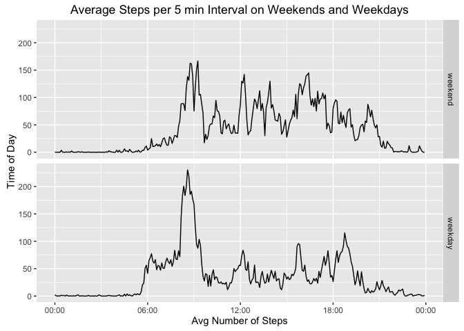

# Reproducible Research Course Project 1
Gavin Leeper  
December 20, 2016  


## Average Number of Steps Per Day

Let us start by loading the data and looking at its structure. As suggested in the assignment description, the steps attribute has a significant number of NA values that we'll ultimately need to decide how to deal with. 


```r
library("ggplot2")
library("dplyr")
```

```
## 
## Attaching package: 'dplyr'
```

```
## The following objects are masked from 'package:stats':
## 
##     filter, lag
```

```
## The following objects are masked from 'package:base':
## 
##     intersect, setdiff, setequal, union
```

```r
act_data<-read.csv("activity.csv")
str(act_data)
```

```
## 'data.frame':	17568 obs. of  3 variables:
##  $ steps   : int  NA NA NA NA NA NA NA NA NA NA ...
##  $ date    : Factor w/ 61 levels "2012-10-01","2012-10-02",..: 1 1 1 1 1 1 1 1 1 1 ...
##  $ interval: int  0 5 10 15 20 25 30 35 40 45 ...
```

```r
summary(act_data$steps)
```

```
##    Min. 1st Qu.  Median    Mean 3rd Qu.    Max.    NA's 
##    0.00    0.00    0.00   37.38   12.00  806.00    2304
```

Now, we can total up the number of steps taken each day using dplyr and look at the distribution of daily total steps. I'll use ggplot2 for all of the visualizations in this analysis.

```r
daily_steps<-act_data%>%group_by(date)%>%summarize(steps =sum(steps))
qplot(daily_steps$steps)
```

```
## `stat_bin()` using `bins = 30`. Pick better value with `binwidth`.
```

```
## Warning: Removed 8 rows containing non-finite values (stat_bin).
```

<!-- -->

```r
summary(daily_steps$steps)
```

```
##    Min. 1st Qu.  Median    Mean 3rd Qu.    Max.    NA's 
##      41    8841   10760   10770   13290   21190       8
```

```r
daily_steps_mean<-mean(daily_steps$steps, na.rm = TRUE)
daily_steps_median<-median(daily_steps$steps, na.rm = TRUE)
```
As we see in the summary, when we aggregate the data by date in this way, we get a mean total number of steps per day of 1.0766189\times 10^{4} and a median of 10765.

##Daily Exercise Patterns

Now, to look at the average activity pattern over the course of a given day, we can group the data based on the 5 minute intervals during which the observed steps occur and take the average. For now, I'll remove NA values to look at this distribution, and we can revisit it and think about imputing missing values later on. For our plot, I'll also make sure to graph the time series with POSIX.ct on the x-axis because as of now, with our interger representation of time (e.g. 13:55 as 1355) we get discontinuities each hour between, for example 1355 and 1400.


```r
library(scales)
avg_steps_at_time<-act_data%>%group_by(interval)%>%summarize(steps = mean(steps,na.rm=TRUE))

#Generate the Posixct vector for plotting
times<-seq(ISOdatetime(2012,10,1,0,0,0), ISOdatetime(2012,10,2,0,0,0), by=(60*5))
times<-times[1:288]

#Use the Scales library and a timezone ignoring implimentation of the date_format function to generate
#the desired plot.
date_format <- function(format = "%H:%M") {
    
    function(x) format(x, format)
}

ggplot(data=avg_steps_at_time,aes(x=times, y=steps, group=1))+geom_line()+scale_x_datetime(labels = date_format("%H:%M"))
```

<!-- -->

Within this aggregated dataframe, we can simply select for the interval with the largest average steps


```r
avg_steps_at_time[avg_steps_at_time$steps==max(avg_steps_at_time$steps),]
```

```
## Source: local data frame [1 x 2]
## 
##   interval    steps
##      <int>    <dbl>
## 1      835 206.1698
```

```r
max_step_time<-avg_steps_at_time[avg_steps_at_time$steps==max(avg_steps_at_time$steps),1]
```

It looks like the studied individual is most active around 835.

##Missing Values

There are a significant number of missing values in this dataset that may be throwing off some of our summary calculations.

```r
sum(is.na(act_data$steps))
```

```
## [1] 2304
```

For each of these missing values, let's impute the average for that 5 minute interval of the day with the following code. While we're at it, we can go ahead and create a new version of the data as originally formatted, but with these imputed values that I'll name new_data. We'll then reaggregate the daily totals in this new dataset and recalculate the mean and median, as well as showing the histogram of these newly computed values.


```r
merged<-merge(act_data,avg_steps_at_time, by = 'interval')
merged$steps.x[is.na(merged$steps.x)]<-merged$steps.y[is.na(merged$steps.x)]
new_data<-select(merged, steps=steps.x, date,interval)%>%arrange(date)

new_daily_steps<-new_data%>%group_by(date)%>%summarize(steps =sum(steps))
qplot(new_daily_steps$steps)
```

```
## `stat_bin()` using `bins = 30`. Pick better value with `binwidth`.
```

<!-- -->

```r
summary(new_daily_steps$steps)
```

```
##    Min. 1st Qu.  Median    Mean 3rd Qu.    Max. 
##      41    9819   10770   10770   12810   21190
```

```r
new_mean<-mean(new_daily_steps$steps)
new_median<-median(new_daily_steps$steps)
```

As we see in the new summary, the treated data now has a mean total daily steps of 1.0766189\times 10^{4} and a median of 1.0766189\times 10^{4}. As the data stands at the time of this document's writing, it looks like imputing data has mostly caused the 2nd quartile of the sums to grow. 

##Weekday vs. Weekend Behavior

To compare the distibution of weekdays versus weekends, let's make a factor variable that splits the data into these two groups for the remainder of our analysis. For this, we'll first need to convert the 'date' parameter to a Date format so that the weekdays() function works properly. We'll then aggregate the data as before to plot the distribution of averages by weekend and weekday. 

```r
new_data$date<-as.Date(new_data$date)
weekdays1 <- c('Monday', 'Tuesday', 'Wednesday', 'Thursday', 'Friday')
new_data$wDay <- factor((weekdays(new_data$date) %in% weekdays1), 
         levels=c(FALSE, TRUE), labels=c('weekend', 'weekday'))
new_avg_steps_at_time<-new_data%>%group_by(interval,wDay)%>%
  summarize(steps = mean(steps))%>%arrange(wDay)

times2<-c(times,times)
ggplot(data=new_avg_steps_at_time,aes(x=times2, y=steps, group=1))+geom_line()+facet_grid(wDay ~ .)+scale_x_datetime(labels = date_format("%H:%M"))+facet_grid(wDay ~ .)+ggtitle("Average Steps per 5 min Interval on Weekends and Weekdays")+ylab("Time of Day")+xlab("Avg Number of Steps")
```

<!-- -->

Observing the two distributions side by side, we see more activity during business hours on the weekends than on weekdays, which confirms the natural intuition assuming the subject is a normal office worker.
